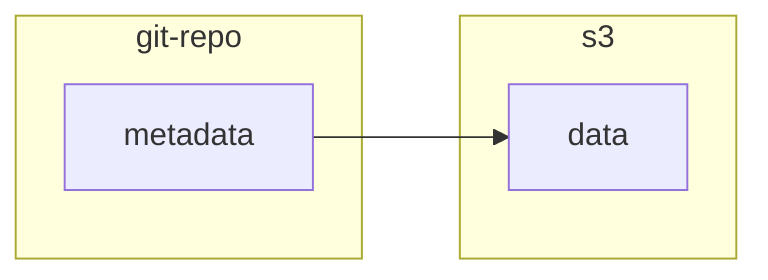

# shelf

_A personal ETL and data lake._

Status: in alpha, changing often

## Overview

Shelf is an opinionated small-scale ETL framework for managing data files and directories in a content-addressable way.

## Core principles

### A framework

`shelf` is motivated by the desire to take the best bits of [Our World In Data's ETL](https://github.com/owid/etl) and make the core concept reusable for multiple projects.




### Metadata included

`shelf` is designed to make space for metadata to be kept about every file, and to propagate that metadata sensibly when it can. This lets you store details about data provenance and data access right next to the data.

🔮 (in future) Bring-your-own JSONSchema for metadata, to meet the standards of your own project

### Merkle tree

- Define your DAG in `shelf.yaml`, keep data in `data/` and step code in `src/steps`, version controlled in Git
- Each resource that your DAG can build is built off of a chain of checksums that includes data, metadata and scripts
  - This allows `shelf run` to perform content-aware rebuilds of only data that is out of date

### Data versioning

As well as checksums, all data is versioned by ISO date or by `latest`.

### Snapshots and derived tables

- Snapshot data to make it available to `shelf` and archived in S3
- Derive tables from snapshots and other tables that meet sensible data standards and form a helpful workflow

### Opinionated workflow for data science

- The core concept for `shelf` is data tables
  - Tables must use `snake_case` column names and have at least one `dim_` prefixed column indicating a dimension
  - Tables may have `meta_` prefixed columns indicating metadata
- 🔮 (in future) Support for an opinionated workflow of steps
  1. Snapshot and describe the data as it is
  2. Bring it into a common format and data standards
  3. Harmonize and clean it
  4. 🔀 Remix to your heart's content

### Polyglot support

- Support out of the box for arbitrary executable scripts that meet the signature `my_script [dep1 [dep2 [...]] output_table`
- 🔮 (in-future) Automatic support for Juypter Notebook steps
- 🔮 (in-future) Automatic support for duckdb steps

## Usage

### Install the package

Start by installing the shelf package, either globally, or into an existing Python project.

`pip install git+https://github.com/larsyencken/shelf`

### Initialise a shelf

Enter the folder where you want to store your data and metadata, and run:

`shelf init`

This will create a `shelf.yaml` file, which will serve as the catalogue of all the data in your shelf.

### Configure object storage

You will need to configure your S3-compatible storage credentials in a `.env` file, in the same directory as your `shelf.yaml` file. Define:

```
S3_ACCESS_KEY=your_application_key_id
S3_SECRET_KEY=your_application_key
S3_BUCKET_NAME=your_bucket_name
S3_ENDPOINT_URL=your_endpoint_url
```

Now your shelf is ready to use.

### Shelving a file or folder

From within your shelf folder, run `shelf snapshot path/to/your/file_or_folder dataset_name` to add a file to your shelf. See the earlier overview for choosing a dataset name.

```
shelf snapshot ~/Downloads/countries.csv countries/latest
```

This will upload the file to your S3-compatible storage, and create a metadata file at `data/<dataset_name>.meta.yaml` directory for you to complete.

The metadata format has some minimum fields, but is meant for you to extend as needed for your own purposes. Best practice would be to retain the provenance and licence information of any data you add to your shelf, especially if it originates from a third party.

### Building your shelf

Run `shelf run` to fetch any data that's out of date, and build any derived tables.

## Bugs

Please report any issues at: https://github.com/larsyencken/shelf/issues

## Changelog

- `dev`
  - Initialise a repo with `shelf.yaml`
  - `shelf add` and `shelf run` with file and directory support
  - Only fetch things that are out of date
  - `shelf list` to see what datasets are available
  - `shelf audit` to ensure your shelf is coherent and correct
